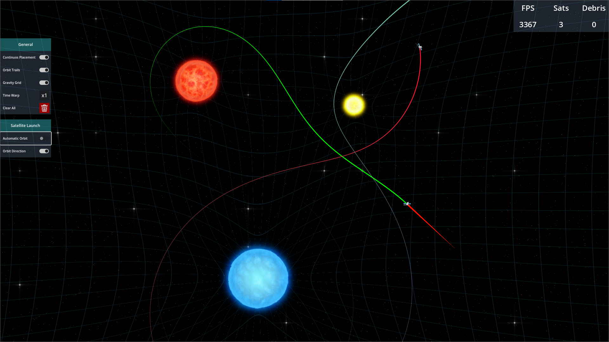
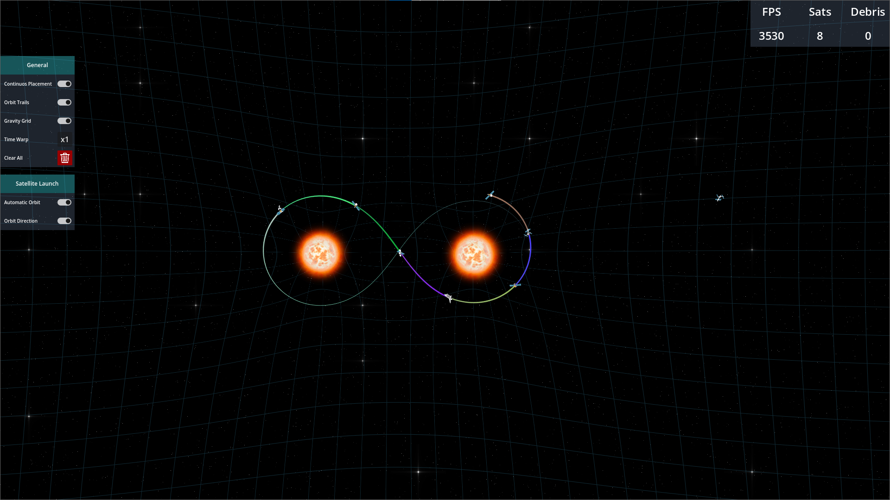
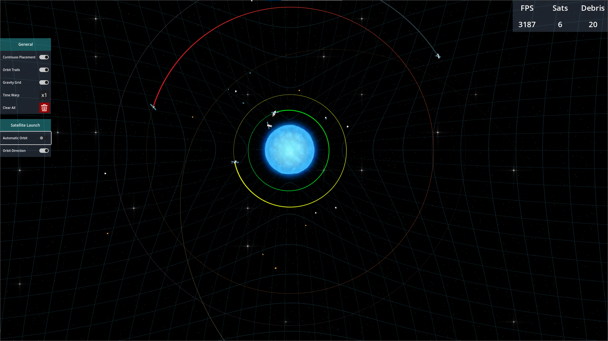
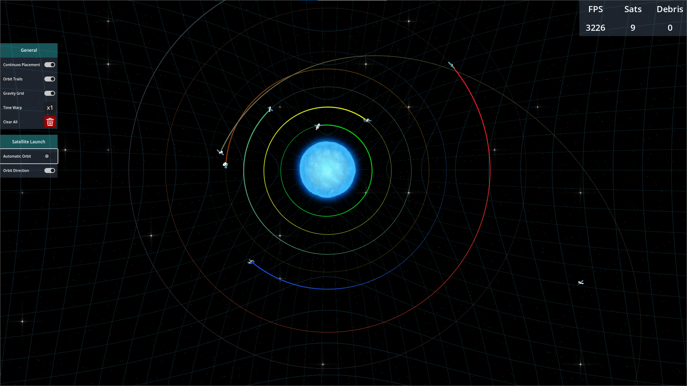
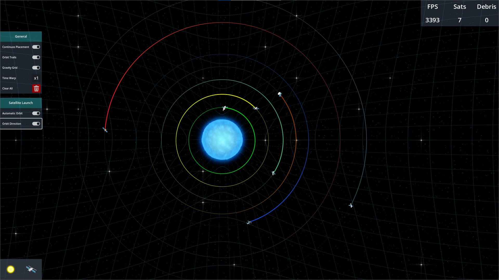

# 2D Orbital Mechanics

A 2D physics-based sandbox simulation game where players can create stars, planets, and satellites, watch their orbits, and experiment with gravity. Built with Godot 4.4 for my public portfolio, it demonstrates procedural physics simulation, interactive UI tools, and custom game mechanics.

---

## Play the Game
Try it out on [Itch.io](https://djemss7.itch.io/2d-orbital-mechanics)

---

## Features
- Spawn stars and satellites with adjustable properties
- Realistic orbital physics simulation
- Visual trails for orbiting satellites
- Debris generation upon collisions
- Adjustable timewarp for fast-forward simulation
- Toggleable gravity grid to visualize forces
- Camera with drag and parallax background
- Interactive UI panels for editing celestial bodies

---

## Screenshots

